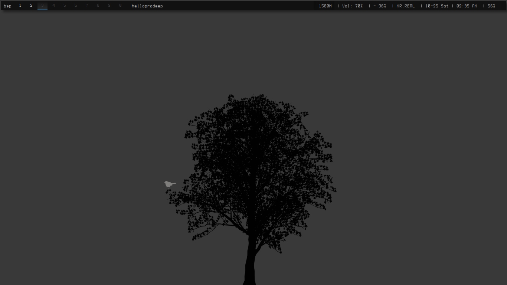
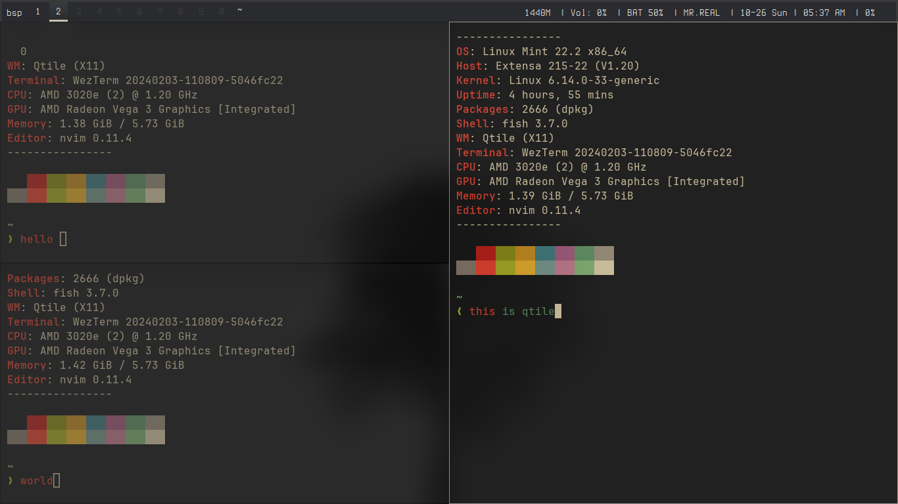

## Qtile



- simple qtile config that just work no beautiful stuff and no pretty animation .
- I like it
- This configuration is built for **Linux Mint**. Other distros may require adjustments.

### DEPENDENCIES

```bash
cmake picom rofi wezterm alacritty fish neovim btop lxappearance
 feh dunst git curl wget fzf tmux bat unzip qtile
```

### Installation

- install Qtile using their website
- [Qtile](https://docs.qtile.org/en/stable/manual/install/index.html)

1. clone this repo

```bash
git clone https://github.com/hellopradeep69/Qtile-conf.git
cd Qtile-conf
```

2. Run script to install

```bash
chmod +x setup.sh
./setup.sh
```

- If any issue , create/report an
  [Issue](https://github.com/hellopradeep69/Qtile-conf/issues)

#### More screenshot



#### More config

- [ Bspwm config ](https://github.com/hellopradeep69/bspwm-config.git)
